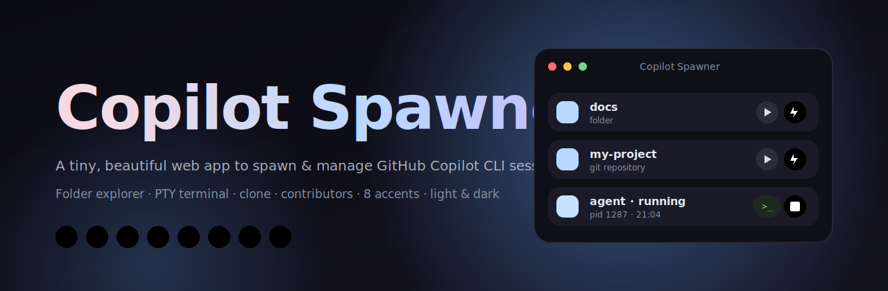
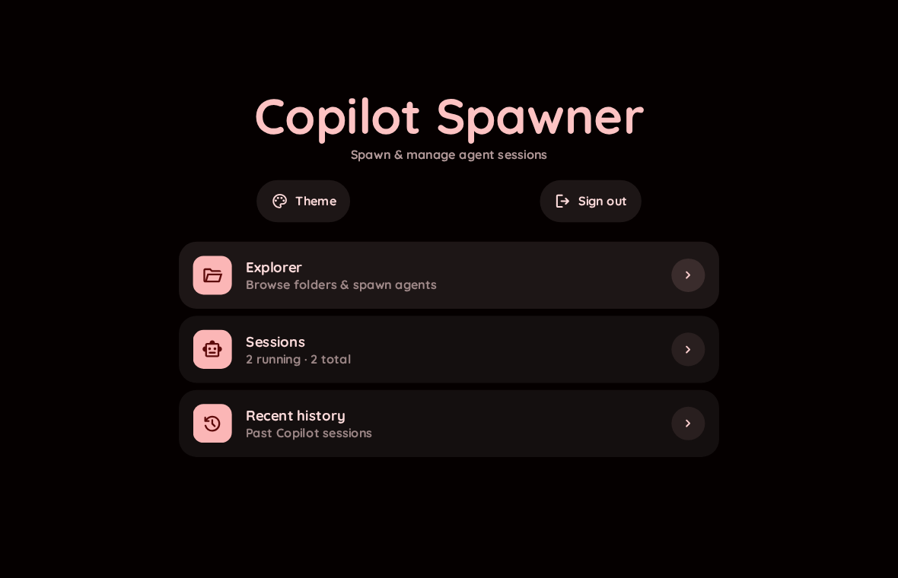
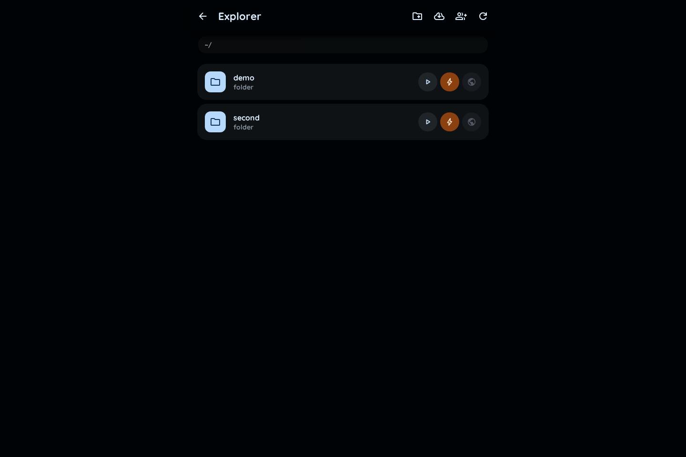
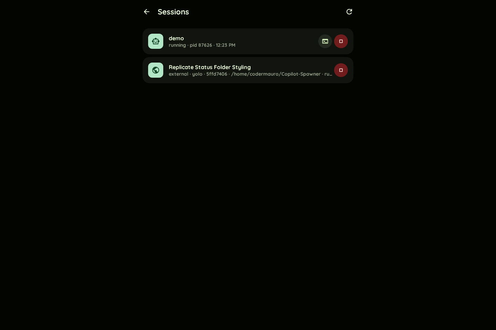
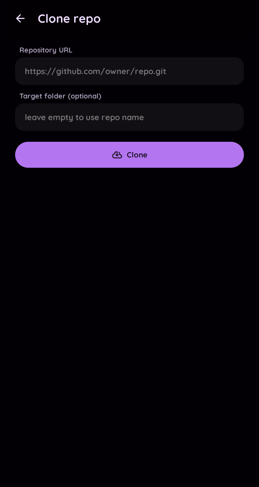
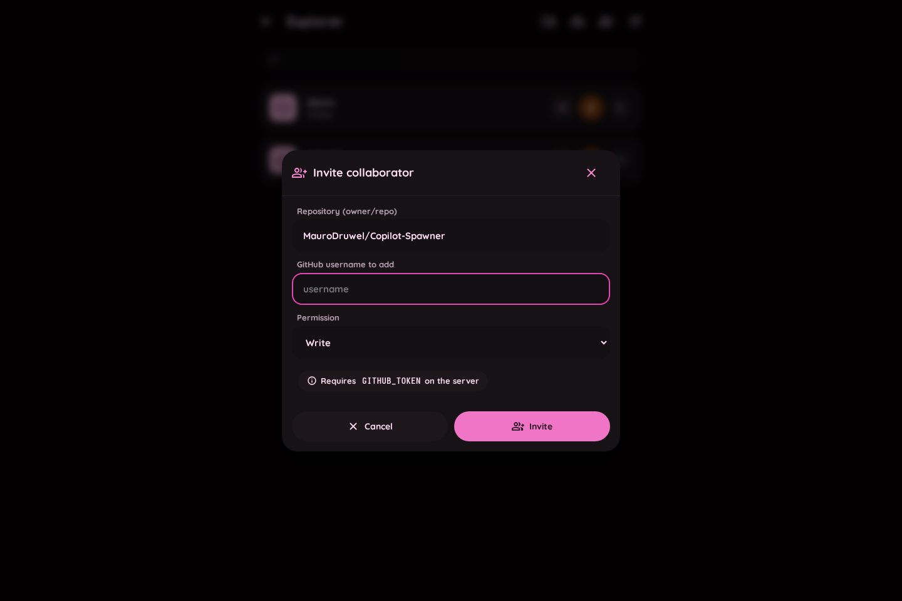
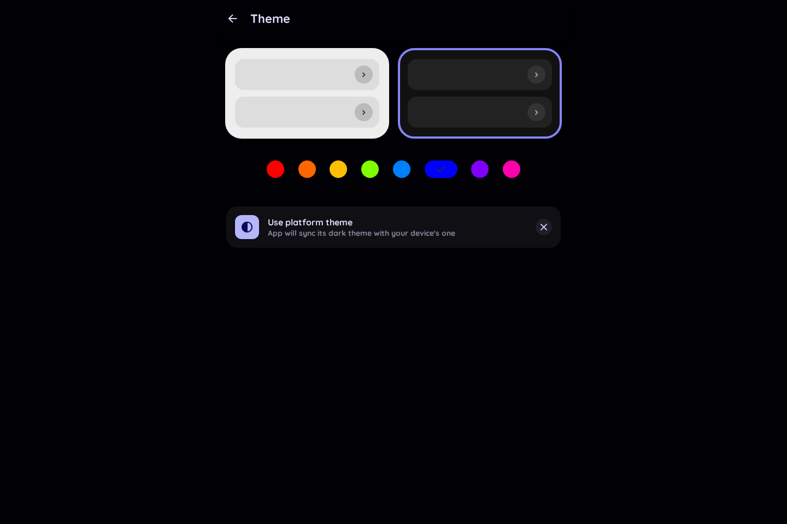
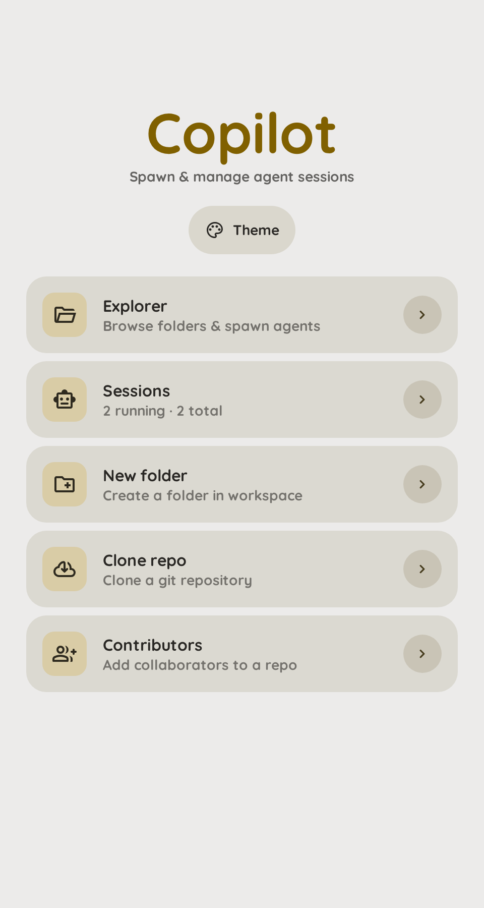
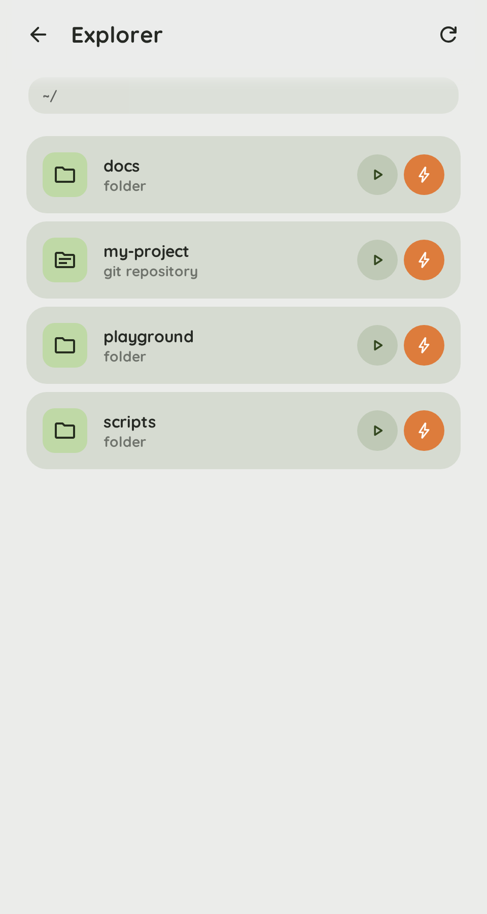
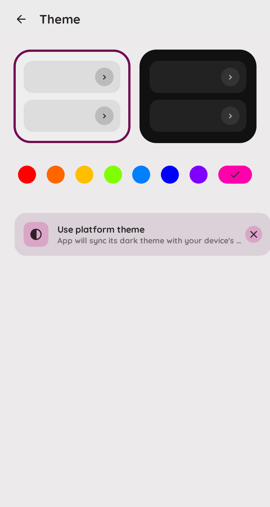

<p align="center">
	
</p>

<h1 align="center">Copilot Spawner</h1>

<p align="center">
	A tiny, self-hosted web app to spawn and manage <b>GitHub Copilot agent</b> sessions from a folder explorer.
	<br>
	PTY-backed web terminals, light/dark themes, eight accent colors — all behind a simple password login.
</p>

<p align="center">
	<a href="https://www.python.org/"></a>
	<a href="https://github.com/aio-libs/aiohttp"></a>
	<a href="./LICENSE"></a>
	<a href="#contributing"></a>
	
</p>

---

## Why

Running `copilot --remote` on a server is powerful, but juggling dozens of terminals across folders gets messy fast. Copilot Spawner gives you:

- a **file explorer** that treats every folder as a possible agent,
- a **one-click play** (and a one-click **yolo** ⚡) to start `copilot --remote`,
- a **live, interactive web terminal** for each session (real PTY, `xterm.js` frontend),
- and a small dashboard to **clone repos**, **create folders**, and **invite contributors**.

All locked behind a password, ready to sit safely behind Cloudflare or any reverse proxy.

## Screenshots

| Main | Explorer | Sessions |
|---|---|---|
|  |  |  |

| Clone | Contributors | Theme |
|---|---|---|
|  |  |  |

| Light main | Light explorer | Light theme |
|---|---|---|
|  |  |  |

## Features

- **Explorer** — browse a configurable workspace, one click to enter a folder
- **Two spawn modes per folder** — `▶` for `copilot --remote`, `⚡` for `copilot --remote --yolo`
- **Real PTY sessions** — backed by `pty.fork()`, so interactive CLIs and ANSI output work exactly as they do locally
- **Web terminal** — live bidirectional I/O over WebSocket, rendered with `xterm.js`, auto-resizes with the modal
- **Session manager** — list, view transcript, stop, delete
- **Adopts external sessions** — on Linux, scans `/proc` so `copilot --remote` processes started outside the app still show up in the list and can be stopped (you can't attach a terminal to them — we don't own their PTY)
- **Workspace actions** — create folders and clone git repos without leaving the UI
- **Contributors** — invite GitHub collaborators via the API (needs a `GITHUB_TOKEN`)
- **Themes** — eight accent colors, light/dark, follows platform theme if you want
- **Auth** — cookie-based password login, HMAC-signed, constant-time password check
- **Stateless** — nothing is persisted on disk besides your workspace folder

## Quick start

```bash
git clone https://github.com/MauroDruwel/Copilot-Spawner.git
cd Copilot-Spawner
pip install -r requirements.txt

export COPILOT_SPAWNER_PASSWORD='choose-a-strong-password'
export COPILOT_SPAWNER_SECRET="$(python -c 'import secrets;print(secrets.token_hex(32))')"
python app.py
```

Open <http://127.0.0.1:8765> and sign in.

> If you don't set `COPILOT_SPAWNER_PASSWORD`, the app prints an ephemeral password to stderr on startup. That's fine for local testing, but set it explicitly for anything longer-lived so restarts don't rotate the secret.

## Deployment

Copilot Spawner serves plain HTTP on localhost by design. For any network exposure, put it behind a reverse proxy that terminates TLS.

### Cloudflare Tunnel (recommended)

```bash
cloudflared tunnel --url http://127.0.0.1:8765
```

Cloudflare gives you HTTPS, DDoS protection, and Access policies for free. Combine it with the built-in password for defense in depth.

### Systemd

```ini
# /etc/systemd/system/copilot-spawner.service
[Unit]
Description=Copilot Spawner
After=network.target

[Service]
Environment=COPILOT_SPAWNER_PASSWORD=change-me
Environment=COPILOT_SPAWNER_SECRET=long-random-hex
Environment=COPILOT_WORKSPACE=/var/lib/copilot-spawner
WorkingDirectory=/opt/copilot-spawner
ExecStart=/usr/bin/python3 app.py
Restart=on-failure
User=copilot

[Install]
WantedBy=multi-user.target
```

### Docker

The repo ships without a Dockerfile, but a three-line one works:

```dockerfile
FROM python:3.12-slim
RUN apt-get update && apt-get install -y --no-install-recommends git && rm -rf /var/lib/apt/lists/*
WORKDIR /app
COPY . .
RUN pip install --no-cache-dir -r requirements.txt
CMD ["python", "app.py"]
```

## Configuration

All configuration is via environment variables.

| Variable | Default | Description |
|---|---|---|
| `COPILOT_SPAWNER_PASSWORD` | *auto-generated* | Password required at login. **Set this for any real deployment.** |
| `COPILOT_SPAWNER_SECRET` | *auto-generated* | HMAC key for session cookies. If unset, cookies are invalidated on restart. |
| `COPILOT_SPAWNER_HOST` | `127.0.0.1` | Bind address. Prefer `127.0.0.1` behind a proxy. |
| `COPILOT_SPAWNER_PORT` | `8765` | Bind port. |
| `COPILOT_SPAWNER_SESSION_TTL` | `604800` (7d) | Session cookie lifetime in seconds. |
| `COPILOT_SPAWNER_COOKIE_SECURE` | `auto` | `auto`, `true`, or `false`. Auto-detects HTTPS from `X-Forwarded-Proto`. |
| `COPILOT_SPAWNER_MAX_LOG` | `524288` | Max bytes of output retained in memory per session (tail kept). |
| `COPILOT_WORKSPACE` | `./workspace` | Root folder shown in the explorer. |
| `COPILOT_BIN` | `copilot` | Path to the Copilot CLI executable. |
| `GITHUB_TOKEN` | — | Required for the **Contributors** feature. A fine-grained PAT with `Administration: write` works. |

## API

All `/api/*` endpoints require a valid `cs_session` cookie, except `/api/login` and `/api/auth/status`.

| Method & path | Body | Purpose |
|---|---|---|
| `POST /api/login` | `{password}` | Sign in |
| `POST /api/logout` | — | Sign out |
| `GET  /api/auth/status` | — | `{authenticated: bool}` |
| `GET  /api/list?path=<rel>` | — | List folder contents relative to the workspace |
| `GET  /api/sessions` | — | List all sessions |
| `POST /api/sessions/start` | `{path?, resume?, yolo, remote?, cols?, rows?}` | Spawn an agent in a folder, or resume a past Copilot session |
| `POST /api/sessions/{id}/stop` | — | SIGTERM → SIGKILL the session (and its process group) |
| `GET  /api/sessions/{id}/log` | — | Plain-text transcript of captured output |
| `DELETE /api/sessions/{id}` | — | Stop if running, then forget |
| `WS   /api/sessions/{id}/ws` | — | Bidirectional terminal I/O (binary in/out, JSON control frames) |
| `POST /api/folders` | `{name, parent}` | Create a workspace folder |
| `POST /api/clone` | `{url, dir?}` | `git clone` into the workspace |
| `POST /api/contributors` | `{repo, user, permission}` | Invite a GitHub collaborator |

The WebSocket accepts one JSON control message:

```json
{"type": "resize", "cols": 120, "rows": 32}
```

Everything else sent over the WebSocket is written straight to the PTY's master fd.

## Architecture

```
                       ┌────────────────────────────────────────────┐
   Browser             │                 aiohttp app                │
   ┌────────────┐      │  auth_middleware (HMAC-signed cookie)      │
   │  login.html│◀────▶│  /login, /api/login, /api/logout           │
   │ index.html │      │                                            │
   │  xterm.js  │◀═══▶ │  /api/sessions/{id}/ws  ── WebSocket       │
   └────────────┘      │          │                                 │
                       │          ▼                                 │
                       │   SessionManager ── pty.fork() ── child    │
                       │          │                ├─ copilot --remote
                       │          ▼                └─ in a cwd
                       │   async pty reader → ring buffer + peers   │
                       └────────────────────────────────────────────┘
```

## Security model

- **Password** — stored only in memory; comparisons use `hmac.compare_digest`.
- **Sessions** — opaque HMAC-signed tokens, not JWTs. Cookie is `HttpOnly`, `SameSite=Lax`, and `Secure` when served over HTTPS.
- **Paths** — every workspace operation is resolved against the workspace root; any attempt to escape returns `403`.
- **Commands** — the Copilot invocation is `execvp`'d with a fixed argv (`[COPILOT_BIN, "--remote"(, "--yolo")]`) — no shell interpolation.
- **Process groups** — each PTY child becomes its own session leader, so stopping a session terminates the whole group.
- **Rate limiting** — not built in. Put Cloudflare, fail2ban, or another reverse proxy in front for anything public.

If you find a vulnerability, please follow [SECURITY.md](SECURITY.md).

## Contributing

PRs welcome. The project is intentionally small; the goal is to stay readable, not to grow features. See [CONTRIBUTING.md](CONTRIBUTING.md) and the [code of conduct](CODE_OF_CONDUCT.md).

Good first issues:

- A Dockerfile and `docker-compose.yml`
- Session persistence across restarts
- Multiple users / RBAC (currently one shared password)
- A "detach" indicator when a WebSocket drops but the agent keeps running
- Tests (the project currently has none)

## Credits

- UI visual language and theme picker are inspired by [dani3l0/Status](https://github.com/dani3l0/Status) (MIT). The fonts (Quicksand, Material Symbols) and the accent-color CSS come from that repo.
- Terminal rendering by [`xterm.js`](https://xtermjs.org/).
- Server by [`aiohttp`](https://docs.aiohttp.org/).

## License

[MIT](LICENSE) © 2026 Mauro Druwel
